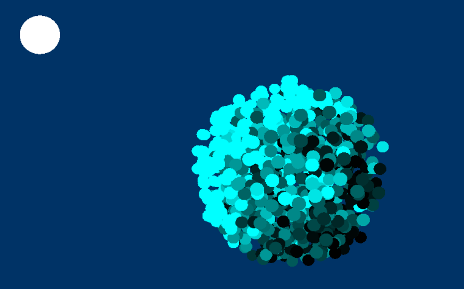
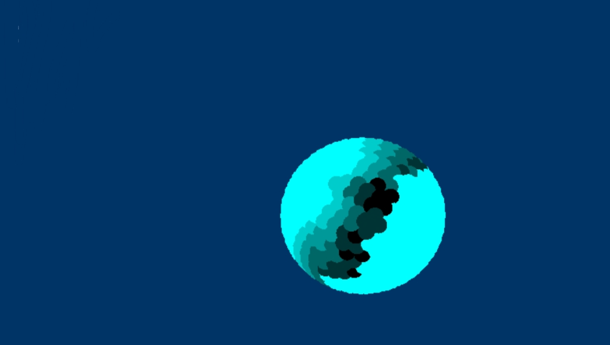

> Дан структурный буфер частиц в размере от 2 до 1024 элементов. Каждый партикл имеет радиус больше 0, и непрозрачность от 0 до 1 (1 - полностью непрозрачный). Расстояния между партиклами сопоставимы с их радиусами. Направление на солнце задано нормализованным вектором sunDir. Система координат: X-вперед, Y-вверх, Z-вправо.

#### 1. Предложите варианты расчета самозатенения системы частиц

- Сортировка. Можно предварительно отсортировать частицы по мере их удаления от источника света. А затем в `sbShadows[i]` записать `sbShadows[i+1] * 0.7`. Подойдёт только в том случае, когда положение ни одной из частиц в системе не меняется динамически.

- Карта теней. Подойдёт, скорее, для быстрого вычисления тени, отбрасываемой самой системой.

- Grid-based. Можно разбить пространство на сетку и рассчитать, сколько света проходит через каждую ячейку. Не подойдёт в случае неравномерного распределения частиц. Если система динамичная, постоянное обновление сетки приведёт к падению производительности.

- Трассировка лучей. Если в пиксельном шейдере луч направляется в каждый пиксель, то в вычислительном в качестве пикселя можно использовать частицу целиком.

#### 2. Напишите на hlsl оптимальный по быстродействию compute шейдер (Shading Model 5) с расчетом самозатенения частиц, результат вычислений записать в sbShadows. sbShadows имеет такое же количество элементов что и sbParticles, индексы совпадают.

Каждая частица представлена окружностью (сферой). Учитывая то, что источником света является Солнце, то есть объект на бесконечности, который излучает параллельный направленный свет, не нужно учитывать угол, под которым падают лучи (то есть алгоритм предполагает, что лучи, приходящие к частице, полностью параллельны). Если провести прямую из центра частицы `p0` к источнику света, то количество других частиц (сфер), которые пересечёт эта прямая, и будет влиять на яркость частицы.
Это можно выразить одним уравнением:

`t^2 * (bx^2 + by^2 + bz^2) + t * 2 * (bx * (ax - x0) + by * (ay - y0) + bz * (az - z0)) + ((ax - x0)^2 + (ay - y0)^2 + (az - z0)^2 - r^2) = 0`

`r` – радиус частицы `p1`, которая, предположительно, перекрывает частицу `p0`

`х0`, `у0`, `z0` – координаты центра частицы `p1`

`ax`, `ay`, `az` – координаты начала прямой (от центра `p0` к источнику света)

`bx`, `by`, `bz` – направление прямой (от центра `p0` к источнику света)

`t` – исходная точка ближайшего пересечения, которую необходимо найти (достаточно просто знать, есть ли она).

Но если сравнивать каждую частицу со всеми остальными, потребуется `O(n^n)` итераций для каждого потока, что, конечно, слишком много, когда частиц больше 10-ти. 
Решение можно оптимизировать: частицы, с которыми пересечение невозможно, отбрасываются. 

_Пример ниже для двумерного пространства, готовый вариант отмасштабирован на трёхмерное._

В случае, когда источник света находится правее от частицы, нет смысла рассматривать пересечение с теми частицами, что находятся левее. Получается, что (слева направо) для первой частицы будет проанализировано пересечение с двумя окружностями, для второй – с одной, а для третьей вообще ни с чем.

Если высчитать сложность после оптимизации, исходя из _худшего_ случая (когда все частицы в ряд друг за другом, то есть каждая, кроме последней, затенена), получается:

`1 + 2 + 3 + ... + 1023 + 1024 = n * (a_1 + n) / 2 = n / 2 + n^2 / 2 = O(n^2).`

Если рассматривать финальную демонстрацию и то, как повлияли изменения на производительность: 

На тестируемой видеокарте (Intel Integrated UHD 620) для системы из 1024 частиц такая оптимизация ускорила рендеринг почти в 6 раз. Алгоритм рассчитан на то, чтобы вызывать вычислительный шейдер каждый кадр, но можно пойти дальше и пересчитывать затенение только если изменяется положение источника освещения.

После стадии вычислительного шейдера можно с помощью [D3D12_HEAP_TYPE_READBACK](https://learn.microsoft.com/en-us/windows/win32/direct3d12/readback-data-using-heaps) прочитать данные из буфера, находящегося в VRAM, назад, в RAM, и посмотреть, сколько частиц было пропущено в цикле. В итоговой демонстрации, в среднем, для каждой частицы было пропущено 700 итераций. (До оптимизации на каждый поток приходилось по 1000+ итераций, после – по 200. Этим и объясняется прирост более чем в 5 раз)

### [Исходный шейдер](https://github.com/naiderrp/DirectX12-Self-shadowed-Particle-System/blob/main/src/direct-test/ComputeShader.hlsl)

#### Модификация

Рассмотренный выше алгоритм достаточно универсален: не имеет значения ни радиус частиц, ни то, насколько далеко они друг от друга. Но если наложить на систему некоторые ограничения, можно снова получить прирост.
Когда частицы находятся друг от друга на расстоянии, не большем чем радиус, достаточно вдоль всё той же прямой от центра частицы `p0` к источнику света отступить `t = 2 * radius`. И если получившаяся точка принадлежит окружности частицы `p1`, то `p1` затеняет `p0`. И в `sbShadows[p0]` запишется значение `shShadows[p1] * 0.7`
Но есть недостаток:
Что, если в момент чтения `sbShadows[p1]` другой поток делает туда запись? Что, если корректное затенение для p1 ещё не вычислено? Необходимо синхронизировать операции чтения-записи ячейки памяти, из-за чего модификация алгоритма приводит к незначительному приросту производительности. Всего 20% на моей видеокарте.

_Источник света находится за шаром, все частицы располагаются на расстоянии radius от центра, то есть фигура внутри полая._
